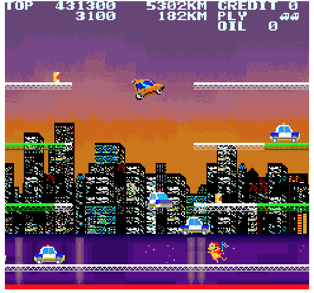

# Disable-Image-Smoothing.safariextension
Disables image smoothing using CSS so you can see the individual pixels.
Images that have been affected have a thick red bottom border.

# Why?
So you can zoom in using browser page zoom controls and be able to see images in all their chunky pixel glory.

# What do modified images look like?


# How does it work?
```css
body > img:only-of-type, .mw-mmv-image img {
	image-rendering: optimizeSpeed !important;
	border-bottom: 4px solid red !important;
}
```

# Which images are targeted?
Currently only two types of images are targeted:

* images opened in a new tab or window (ie. viewed directly in the browser outside of a webpage)
* images being viewed using the [Wikipedia Media Viewer](https://en.wikipedia.org/wiki/Wikipedia:Media_Viewer)

If you have any requests for other types of images to include please file a pull request or issue.

# Changelog
2015-01-26, 2.0: Initial Public Version  
2015-01-24, 1.0: Initial Version
